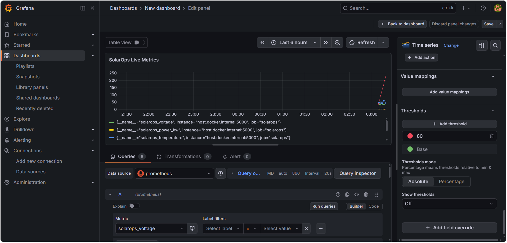

# SolarOps Dashboard

A production-grade cloud-native solar plant monitoring system built with modern DevOps practices.


---

## Project Overview

SolarOps Dashboard is a cloud-native application that simulates and monitors real-time solar panel data including voltage, current, power output, and temperature. Built to demonstrate end-to-end DevOps engineering skills from application development to cloud deployment, infrastructure automation, and live monitoring.

This project combines 4 years of solar energy domain expertise from Enphase Energy with modern DevOps tooling.

---

## Architecture

```
GitHub Code Push
      |
GitHub Actions (CI/CD Pipeline)
      |
Docker Image Build -> Push to AWS ECR
      |
Terraform provisions AWS Infrastructure
      |
Kubernetes (Minikube / EKS) deploys app
      |
Prometheus scrapes metrics every 15s
      |
Grafana displays live solar dashboard
```

---

## Tech Stack

| Category | Technology |
|---|---|
| Application | Python 3.13, Flask |
| Containerization | Docker 29.5 |
| Container Registry | AWS ECR |
| Infrastructure as Code | Terraform 1.15 |
| Orchestration | Kubernetes 1.35 (Minikube) |
| CI/CD | GitHub Actions |
| Monitoring | Prometheus + Grafana |
| Cloud | AWS (EC2, VPC, ECR, IAM) |
| Version Control | Git, GitHub |
| OS | Linux (Ubuntu), Windows |

---

## Live Solar Metrics

The dashboard monitors real-time solar panel data:

| Metric | Description | Range |
|---|---|---|
| Voltage | Panel output voltage | 30-45 V |
| Current | Electrical current | 5-10 A |
| Power Output | Energy generated | 1.5-5.0 kW |
| Temperature | Panel surface temp | 25-65 C |
| Status | Panel health status | ACTIVE / FAULT |

---

## Project Structure

```
solarops-dashboard/
|
|-- app.py                          # Flask solar monitoring app
|-- Dockerfile                      # Docker container config
|-- ecr-commands.txt                # AWS ECR push reference
|-- .gitignore                      # Git ignore rules
|
|-- terraform/
|   |-- main.tf                     # AWS infrastructure as code
|                                   # VPC, Subnet, IGW, Security Group
|
|-- kubernetes/
|   |-- deployment.yaml             # K8s deployment (2 replicas)
|   |-- service.yaml                # K8s NodePort service
|
|-- monitoring/
|   |-- prometheus.yml              # Prometheus scrape config
|
|-- .github/
    |-- workflows/
        |-- deploy.yml              # CI/CD pipeline config
```

---

## Getting Started

### Prerequisites
- Python 3.11+
- Docker Desktop
- AWS CLI configured
- kubectl
- Terraform
- Minikube

### 1. Clone Repository
```bash
git clone https://github.com/Mddanish123-111/solarops-dashboard.git
cd solarops-dashboard
```

### 2. Run Locally
```bash
pip install flask prometheus-client
python app.py
```
Open browser at http://localhost:5000

### 3. Run with Docker
```bash
docker build -t solarops:v1 .
docker run -p 5000:5000 solarops:v1
```
Open browser at http://localhost:5000

### 4. Deploy on Kubernetes
```bash
minikube start --driver=docker
minikube image load solarops:v1
kubectl apply -f kubernetes/deployment.yaml
kubectl apply -f kubernetes/service.yaml
minikube service solarops-service
```

### 5. Start Monitoring
```bash
# Start Prometheus
docker run -d --name prometheus -p 9090:9090 \
  -v $(pwd)/monitoring/prometheus.yml:/etc/prometheus/prometheus.yml \
  prom/prometheus

# Start Grafana
docker run -d --name grafana -p 3000:3000 grafana/grafana
```

- Prometheus: http://localhost:9090
- Grafana: http://localhost:3000 (login: admin / admin)

---

## CI/CD Pipeline

Every push to the main branch automatically:

1. Checks out latest code
2. Configures AWS credentials from GitHub Secrets
3. Logs into AWS ECR
4. Builds Docker image
5. Tags and pushes image to ECR
6. Pipeline completes in approximately 34 seconds

---

## Terraform Infrastructure

Provisions the following AWS resources automatically:

```
aws_vpc              - solarops-vpc (10.0.0.0/16)
aws_subnet           - solarops-subnet (ap-south-1a)
aws_internet_gateway - solarops-igw
aws_security_group   - solarops-sg (ports 22, 5000)
```

Deploy infrastructure:
```bash
cd terraform
terraform init
terraform plan
terraform apply
```

---

## Grafana Dashboard Metrics

| Panel Title | Prometheus Query |
|---|---|
| Solar Voltage | solarops_voltage |
| Power Output | solarops_power_kw |
| Temperature | solarops_temperature |
| Total Requests | solarops_requests_total |
---
## Dashboard Screenshot



---

## AWS Deployment

Docker image hosted on AWS ECR:
```
549116506252.dkr.ecr.ap-south-1.amazonaws.com/solarops-dashboard:latest
```

Push new image:
```bash
aws ecr get-login-password --region ap-south-1 | \
  docker login --username AWS --password-stdin \
  549116506252.dkr.ecr.ap-south-1.amazonaws.com

docker build -t solarops:latest .
docker tag solarops:latest \
  549116506252.dkr.ecr.ap-south-1.amazonaws.com/solarops-dashboard:latest
docker push \
  549116506252.dkr.ecr.ap-south-1.amazonaws.com/solarops-dashboard:latest
```

---

## About This Project

This project was built as a DevOps portfolio project combining solar energy domain expertise with modern DevOps skills.

The author has 4+ years of experience at Enphase Energy as a Proposal Design Engineer working with solar system design, technical documentation, and cross-functional coordination. This background makes the project realistic rather than a generic tutorial application.

---

## Connect

- GitHub: https://github.com/Mddanish123-111
- Email: mdanish395@gmail.com

---

## License

MIT License - free to use and modify.

---

Built by Danish - Solar Engineer transitioning to DevOps Engineer
